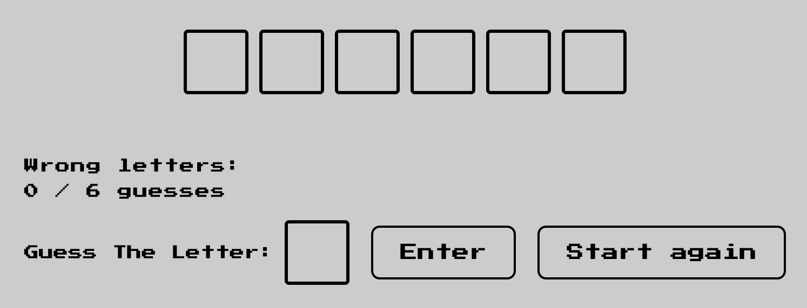

# Hangman Game

Welcome to Hangman Game, a classic word-guessing game brought to life in the digital realm! Hangman Game is designed to entertain and challenge users of all ages while fostering an atmosphere of interactive wordplay. The project aims to provide a nostalgic yet engaging experience for individuals seeking a fun and intellectually stimulating pastime.

# Current & New User Goals

The Hangman Game project is designed with features that cater to the needs of both first-time visitors and returning users. Each feature contributes to the overall gaming experience, making the project appealing and functional for various user goals:

## Landing Page Image

The landing page image serves as the first visual encounter, making a striking impression and providing a quick insight into the Hangman Game's interface and gameplay. It's a key element for users to relate to the atmosphere of the game.

## Game Controls

The Game Controls section centralizes details regarding how to play, and other game-specific information, offering a seamless and clear pathway for players to understand and enjoy the game.

## Overview

Hangman Game brings the timeless pen-and-paper game into the digital age, allowing users to guess word by selecting letters within a specified number of attempts. The game is not just about testing vocabulary; it's about strategy, deduction, and the thrill of solving the puzzle before running out of guesses.

## Target Audience

Hangman Game is tailored for a diverse audience, appealing to casual gamers, word enthusiasts, and anyone looking for a quick and enjoyable mental exercise. Whether you're a solo player challenging your linguistic skills or a group of friends competing to unravel the mystery word, Hangman Game provides a versatile and inclusive gaming experience.

## Key Features

- **User-Friendly Interface:** The game boasts a clean and intuitive design, making it accessible for players of all technological backgrounds.

- **Interactive Gameplay:** Engage with a responsive interface that allows seamless letter selection, providing instant feedback on correct and incorrect guesses.

- **Educational Entertainment:** While primarily a source of entertainment, Hangman Game also serves as an enjoyable educational tool, enhancing vocabulary and cognitive skills.

## Testing

In this section, you will find details about the testing conducted to ensure the reliability and functionality of Hangman Game.

### Lighthouse

#### Performance

- **Score**: 100/100
- **Details**: The game performs well in terms of loading speed and resource utilization.

#### Accessibility

- **Score**: 100/100
- **Details**: The game demonstrates good accessibility practices, ensuring it can be used by a wide range of users.

#### Best Practices

- **Score**: 100/100
- **Details**: The game follows many best practices for web development.

#### SEO

- **Score**: 100/100
- **Details**: The game follows SEO best practices, making it more discoverable to search engines.

### Functional Testing

Hangman Game has undergone thorough functional testing to ensure that all features work as intended.

#### The Gameplay:

- Engaged in multiple rounds of gameplay to assess the word-guessing mechanism.

  
  
  

   

- Verified that selecting letters influences the progress and outcome of the game.
   

  

   
   

- Ensured that the game responds appropriately to correct and incorrect letter guesses.

  

#### Wrong Guesses Tracking:

- Deliberately inputted incorrect letters to validate the tracking of wrong guesses.
- Confirmed that the system accurately counts and displays the number of incorrect attempts.
- Checked for the correct implementation of hangman progression with each wrong guess.

  

#### Losing Game:

- Purposefully made repeated incorrect guesses to experience the losing scenario.
- Confirmed that the game concludes appropriately when the maximum allowed incorrect attempts are reached.
- Verified that the losing screen and message is displayed clearly and effectively.

  

#### Winning Game:

- Successfully guessed the word in multiple rounds to validate the winning scenario.
- Confirmed that the game concludes appropriately when the word is guessed correctly.
- Verified that the winning screen and message is displayed clearly and effectively.

  

#### Instructions:

- The modal (pop up window) displays the instructions fot the "Hangman Game - Countries Edition".

### Validator Testing

- **HTML:** No errors were returned when passing through the official W3C validator.

  - [Result](https://validator.w3.org/nu/?doc=https%3A%2F%2Fwilliampgdias.github.io%2Fhangman-game%2F)

- **CSS:** No errors were found when passing through the official (Jigsaw) validator.

  - [Result](https://jigsaw.w3.org/css-validator/validator?uri=https%3A%2F%2Fwilliampgdias.github.io%2Fhangman-game%2F&profile=css3svg&usermedium=all&warning=1&vextwarning=&lang=en)

- **JS Hint:** No errors were found when passing through the official

  

### Overall Impressions

The gameplay, wrong guesses tracking, and the winning/losing scenarios have been thoroughly tested, ensuring a robust and enjoyable user experience. The system responds as expected, providing engaging feedback throughout the gaming process.

These tests contribute to the confidence that Hangman Game delivers a reliable and functional gaming experience for players of all skill levels.

and other core functionalities have been rigorously tested to provide an easy and straightforward experience for users.

### Cross-Browser and Responsive Testing

The project has been tested on various browsers, including Chrome, Firefox, Safari, and Edge, to ensure compatibility. Additionally, Hangman Game has been designed with responsiveness in mind, and testing has been conducted on different screen sizes to guarantee a seamless experience across devices.

## How to Play

To embark on a journey of word discovery, simply visit the [Hangman Game website](https://williampgdias.github.io/hangman-game/) and follow the instructions provided to start playing. Enjoy the challenge, have fun, and may the words be ever in your favor!

## Deployment

### Step 1: Create a Repository

1. **Login to GitHub:** Visit [GitHub](https://github.com) and log in to the account.
2. **Create a New Repository:**

   - Click on the '+' icon in the top right corner of your GitHub profile.
   - Select "New repository."

3. **Repository Configuration:**
   - Name the repository.
   - Ensure the repository is public.
   - Click the "Create repository" button to finalize.

### Step 2: Upload the Files

4. **Upload The Website Files:**
   - On the newly created repository page, add your website files (HTML, CSS, images, etc.) into the repository by clicking in Upload or Drag the folder into the page.

### Step 3: Enable GitHub Pages

5. **Access Repository Settings:**

   - Inside the repository, go to the "Settings" tab.

6. **GitHub Pages Section:**

   - Scroll down to the GitHub Pages section.
   - Under "Source," select the branch containing your website files.
   - Save the changes.

7. **Confirmation:**

   - GitHub will display the URL where your site is published.

8. **Wait for Deployment:**
   - GitHub Pages might take a few minutes to deploy the site. Once deployed, the website will be live at the provided URL.

### Step 4: Access Your Published Site

9. **Visit The Published Site:**
   - Access the website using the provided URL.
   - Ensure the content displays correctly.

This process will enable to publish and maintain the website using GitHub Pages.

<!-- Deployment ends -->

<!-- How to edit the repository starts -->

### Making Changes on the Project

Whenever changes are made to the project, the developer commits these changes with a descriptive message. This helps other developers understand the project's development progress and assists the developer in keeping track of project changes.

The following steps are followed to manage project changes:

1. **Git add .:** Updates made to the project are included using this command. It stages the changes for the next commit.

2. **Git commit -m "Your commit message here":** After staging the changes, this command is used to capture a snapshot of the project's currently staged changes with a descriptive commit message.

3. **Git push:** This command is used to upload the local repository content to a remote repository. It transfers commits from the local repository to a remote repository, allowing for collaboration and version control.

These steps ensure that the project is regularly updated and documented to facilitate seamless collaboration and development.

<!-- How to edit the repository ends -->

<!-- Credits starts -->

## Credits

In the development of Hangman Game, we acknowledge and provide credit to the following sources for their valuable contributions:

### W3Schools

- To code the modal content, we check the tutorial that was on W3Schools website.

We express our gratitude to these sources for their contributions to our project.
